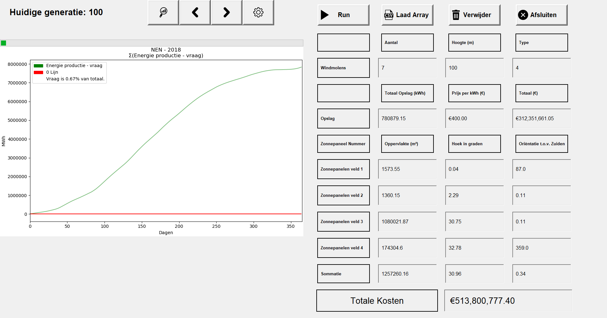

# Portfolio Michiel Maas - 16136640 - Danone Powerplant

## DataCamp
Ik heb alle verplichte Datacamp opdrachten gedaan. [Zien deze afbeelding als bewijs](Sources/datacamp.png Overzicht van DataCamp opdrachten). 
Ik heb bij een eerder blok van van de HBO-ICT: Software Engineering opleiding al deze precieze opdrachten gemaakt. Daarom was het best wel saai, en ik heb ik een beetje gehaast. 

## Subjects
### Research Project
#### Aanpak
Voor dit onderzoek moesten wij kijken naar het optimalizeren van de energie productie van een Renewable Powerplant. Danone wilde graag een 'groene' energie centrale maken, maar dan het liefst zo goedkoop en effiecient mogelijk. Dit is lastig omdat de energie productie van zonnenpanelen en windturbines verschilt over het jaar, en de fabriek het hele jaar door een constante hoeveelheid energie nodig heeft om te blijven draaien. 
De energie die geproduceerd word door deze zonnepanelen en windturbines kan worden opgeslagen, maar dat is heel prijzig. Voordat Danone wilde beginnen aan het project wilde eerst graag goed weten hoe duur het zou worden en wat de beste manier was om dit te doen. 

Wij moesten dus kijken naar: 
> Een powerplant die alleen energie opwekt met zonnenpanelen en windturbines. Deze energie moet genoeg zijn om de fabriek het hele jaar draaiend te houden. En dit alles voor zo min mogelijk geld. 

Hieruit leidde onze onderzoeksvraag: 
> Wat is de optimale opstelling van een hybride solar/wind energy system voor een fabriek waarbij de kosten het laagst zijn?

Dit hebben we kunnen opdelen in de volgende deelvragen:
* Wat is er nodig om de aangeleverde simulatie in MATLAB aan te sturen via Python?
* Wat is het beste algoritme om de optimale hybride solar/wind energy configuratie te vinden?
* Welke hyperparameters zijn het beste voor het algoritme?
* Welke kosten zijn relevant voor het vinden van de optimale hybride solar/wind energy configuratie?
* Hoe werkt een hybride solar/wind energy systeem?

Deze vragen waren er vooral om ons te leiden in het begin van het process. Aan de hand van deze vragen hebben wij onze stappen kunnen nemen om het onderzoek uit te voeren. 
* Don en ik hebben samen gebrainstormd over het algoritme, en hoe we het konden bouwen. 
* De hyperparamters zijn gekozen door het gemaakte algoritme te tweaken en te kijken wat er uitkwam. Het bleek dat het verhogen van mutaties de tweede helft van de generaties handig was om lokale minima te ontwijken. 
* De kosten berekeningen bleven tijdens het project veranderen. Aurin heeft kabel kosten berekend, en de manier hoe we de prijs van windturbines berekend hebben we een paar keer aangepast. 

#### Methode
##### Algoritme Keuze
Donnely en ik hebben even gebrainstormd over de dingen die wij konden doen, en de manieren om het aan te pakken. Ik stelde voor om een genetisch algoritme te gebruiken, omdat we dit zagen als een goede toepassing en ik er al [ervaring me had in een eerder blok](Sources/Travelling Salesman.java "Travelings Salesman Problem opgelost in Java voor Game of Trades"). 
Een genetisch algoritme is een goede oplossing voor dit systeem omdat we het eigenlijk proberen te 'bruteforecen'. We willen zo veel mogelijk configuraties proberen totdat we de goede hebben, maar dan wel op een slimme manier. 
Dit is precies wat een genetisch algoritme doet. Door allemaal verschillende dingen uit te proberen, en deze resultaten te beoordelen op hun correctheid kan je het algoritme de goede kant op duwen.  Donneley was erg ijverig en had het algoritme al snel af. 
Dit was fijn want hierdoor konden we snel de data analyseren. Maar voor de andere groepsgenoten die met het algoritme en de code moesten werken was het nog best ingewikkeld. Ik heb Aurin en Luc veel geholpen door het Algoritme van Donnely goed uit te leggen zodat 
ze er mee aan de slag konden. Ook met het goed schrijven van code zodat het makkelijk samenwerkt met andere delen en het programma. 

#### Resultaten
De resulaten waren best wel interessant. Sommige dingen haden we verwacht:
* Windturbines zijn erg rendabel en werden dus veel gebruikt
* De optimale hoek en orientatie van zonnenpanelen is ongeveer 37 graden gericht op het zuiden
* In de zomer wordt er veel meer energie opgewekt dan in de winter. 

Zie deze afbeelding van de GUI die ik heb gemaakt voor een overzicht:

Maar wat ons zeker opviel dat er weinig wordt opgeslagen. Dit is omdat de huidige prijs van opslag enorm duur is. Het algoritme berekend dat het goedkoper is om meer zonnenpanelen neer te zetten zodat het zelfs in de wintermaanden genoeg kan produceren om de nacht door te komen. 
Dit zorgt er op zijn beurt weer voor dat het in zomer veel meer produceert dan nodig. In totaal produceert de hele opstelling 150 keer zo veel energie als nodig is, en dit is erg inefficient.  
Je kan ook duidelijk zien dat er een periode is in het begin van het jaar waar de productie erg laag is, en daar veel batterij voor moet gebruiken. Maar de rest van het jaar wordt de batterij bijna niet gebruikt. 

Wat enorm veel geld kan schelen is om op moment waar de productie erg laag is, en de batterijen leeg zijn, stroom in te kopen van het net. Dit is een factor waat we niet naar hebben gekeken, en misschien voor een vervolg onderzoek een goede stap is. 
En andere stap is misschien kijken naar het doorverkopen van de over geproduceerde stroom. Dit kan veel geld opleveren en de opstelling nog voordeliger maken. 

#### Scrum
Persoonlijk ben ik erg fan van planning en overzicht, dus nam ik al snel te taak van Product Owner op me. Ik heb de volgende stappen genomen om het project in goede banen te leiden:
* Ik heb een grote backlog gemaakt van alles dat we moesten 
* Ik heb een gedetailleerd planning gemaakt van wanneer we welke sprint wilden starten
* Ik heb een Scrum Board gemaakt waarop de we taakjes konden bijhouden
* Ik heb een Trello aangemaakt waarop alle project genoten hun taakjes konden bijhouden en informatie konden delen. 

De eerste 2 sprintens gingen erg goed. Ik heb de sprint review geleid en de taken telkens verdeeld. Mensen die hulp nodig hadden konden dat goed aangeven en de taken liepen makkelijk door. Maar toen Donnely het algoritme aan het eind van de tweede week af waren er nogmaar weinig grote taken te verdelen. 
Onderhand waren de taken ookal duidelijk verdeeld en hielden project genoten zich vooral bezig met hun eigen doelen en was er niet heel veel vraag meer na de sprint planningen. Toen onze planning na twee maanden werd gevandaliseerd, en het verlengsnoer uit onze werkruimte werd gestolen, was er niet heel veel vraag meer deze taken. 

#### Git
Als enige Software Engineering student uit het groepje, was ik een enorme voorstander om Github te gebruiken. In de eerste week de [GitHub Repository](https://github.com/michieljmmaas/PowerPlantHHS) opgezet, en de benodigde instelling toegepast. Ik had het ingesteld dat mensen niet direct naar de master konden pushen, zodat die vrij was van merge conflicts. Groepsgenoten moesten een merge request aanmaken om hun stukjes code aan de master toe te voegen. Deze code kon dan controleren, en eventuele merge conflict oplossing. Ik heb vooral Aurin en Luc veel geholpen om hun code goed te verwerken door hun onbekendheid met Git.
 In totaal zijn er 320 commits gemaakt, 63 merge requests verwerkt. 
 
### Communication
#### Presentaties
Ik gaf in het begin van de periode al aan dat ik goed was in Engels en weinig problemen heb met presenteren. Dit kwam goed van pas omdat er in de groep ook mensen waren die liever niet presenteerden. Ik bood me regelmatig aan om te presenteren, en ben zelfs een paar keer last-minute (terwijl andere groepjes al aan het presenteren waren) ingesprongen toen een projectgenootje te laat was, of het programma niet aan de praat kregen. De presentaties die ik heb gegeven zijn:

* [9 December - Maandag presentatie](Sources/Presentaties/Renewable_power_plant_9_december.pptx)
* [1 November - Milestone presentatie](Sources/Presentaties/Renewable_power_plant_1_november.pptx)
* [14 Oktober - Maandag presentatie](Sources/Presentaties/Renewable_power_plant_14_oktober.pptx)
* [27 September - Milestone presentatie](Sources/Presentaties/Renewable_power_plant_27_september.pptx)

#### Research Paper
Nadat we de meeste research hebben gedaan is het skelet van de paper opgesteld. Alle kopjes werden aangemaakt zodat de project genoten de konden aanvallen. Ik heb samen met Aurin gekeken naar de papers die hij had gevonden, om te beslissen welke het beste aansloegen op wat we wilden schrijven. 
In de tussentijd hebben we veel feedback gekregen van onze opdracht gever, Arie Taal, en begeleider van de Groene Mient Groep, Baldiri Salcedo. Ik heb me best gedaan deze feedback zo goed mogelijk toe te passen op wat we hadden geschreven en benodigde stukken om te schrijven zodat het aan gewenste opmaak voldeed. 
Nadat alle kopjes waren ingevuld, we de alle benodigde resultaten hadden verzameld en alle feedback was verwerkt hebben de paper gezamenlijk verbeterd. De paper wordt op een bescherm getoond, en samen beslisten we hoe we dingen wilde verwoorden. Mijn engels skills kwamen hier goed van pas om de zinnen goed te laten verlopen.  

Omdat het schrijven van de paper voornamelijk gezamenlijk ging is het moeilijk om aan te toenen welke dingen ik precies heb gedaan op dit punt. 

 
### Data prepocessing
#### GUI
Als een van de mensen in de groep met de meeste ervaring met programmeren wilde ik graag een grote inpact maken op het onderzoek. Maar omdat Donneley al het genetisch algoritme had geschreven, en Jeremy bezig was met de link tussen Python en Simulink was er niet meer een duidelijk taak voor mij over. 
Ik heb toen ervoor gekozen om een GUI te maken voor de applicatie.  Hoewel dit niet direct hielp met de voortgang van het onderzoek, was dit later wel heel handig. Onze opdrachtgever, Arie Taal, had veel verzoekjes voor kleine aanpassingen. 
Het implementeren van deze aanpassingen, en het generenen van de output daarvan, kostte veel tijd. Mijn doel was om het makkelijk te maken voor meneer Taal om zelf deze aanpassingen toe te brengen en de gegevens zelf te interpreteren. 
Het belangrijkste was om alle verschillende parameters mee te kunnen geven aan aan het algoritme, zodat die erop kon trainen. Op dit moment is het mogelijk om de volgende paramters mee te geven aan het algoritme:
* Hyperparameters  
  * Aantal Generaties
  * Pool van berekeningen
  * Maximum mutatie percentage van waarde
  * Kosten te weinig productie
  * Vraag van de powerplant  
    * Dit is ook als een .csv bestand om een variabele vraag over het jaar mee te geven
* Zonnepanelen  
  * Kosten per vierkant meter
  * Minimaal oppervlakte zonnenpanelen
  * Maximaal oppervlakte zonnenpanelen
  * redenment van de zonnenpanelen
  * prijs van de zonnenpanelen
* Windturbines
  * Maximaal aantal windturbines
  * Prijs van de windturbines
  * Rendement van de windturbines
  * Terreingestelheid
* Kabel  
  * Lengte van de kaberl
  * Spanning over de kabel
* Prijs van opslag
* Locatie en jaar van weerstation 
  
Dit geeft onze opdrachtgever veel mogelijkheid om de opstelling zo te configuren hoe hij wil, en scheelt het ons tijd om het voor hem te doen. 

Om deze dingen goed mee te geven moesten delen van Donnely's code worden herschrijven. Zie hiervoor de [train()](Sources/train.py) functie, en alle optionele parameters die daaraan worden meegegeven. Die de [Sources/GUI folder](Sources/GUI) voor de code die ik heb geschreven.  
Het gedeelte waar ik nog wel het meest trots op ben zijn de grafieken die overzicht geven van wat het algoritme heeft berekend. Deze afbeeldingen zijn te vinden in de [Sources/GUI_Afbeeldingen](Sources/GUI_Afbeeldingen) folder. [Bekijk ook de video die laat zien hoe het werkt](Sources/GUI_Afbeeldingen/video van GUI.webm). 

De GUI laat de volgende informatie zien:
* Configuratie  
  * Aantal en hoogte van de windturbines
  * Hoeveelheid opslag er nodig is
  * Voor vier verschillende velden van zonnenpanelen:  
    * De oppervlakte
    * De hoek in graden richting de zon
    * De orientatie
    * En een gemiddelde/sommering van de vier velden
* Grafieken  
  * Goedkoopste configuratie uit de pool
  * Gemiddelde prijs uit de pool
  * Productie over het jaar
  * Cummulatieve productie over het jaar
  * Accu gebruik over het jaar
  * Verhouding in energie productie tussen de zonnenpanelen en de windturbines
  * Totale prijs en onderverdeling daarvan
  
Deze gegevens worden iedere generaties geupdate zodat je het algoritme in realtime kan volgen. 

Dit was erg handig om fouten en bugs te herkennen. We kwamen er bijvoorbeeld achter dat het algoritme soms in een lokaal minimum zit waar geen enkele opstelling in de pool genoeg produceert, maar het er zich zelf uiteindelijk weer uit haald. Ook viel het ons op dat het algoritme niet goed convergeerde. 
Als je de prijs van de opslag erg goedkoop maakt, verwacht je dat het algoritme niet zou overproduceren, en alles netjes zou opslaan en her gebruiken. Gelukkig hebben we dit kunnen aanpakken. 

