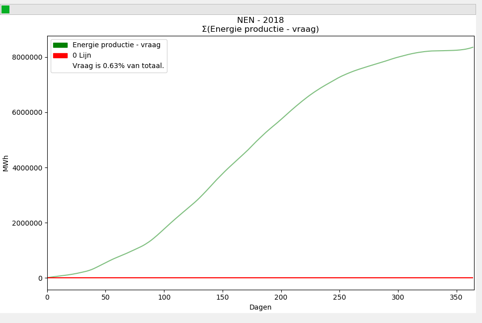
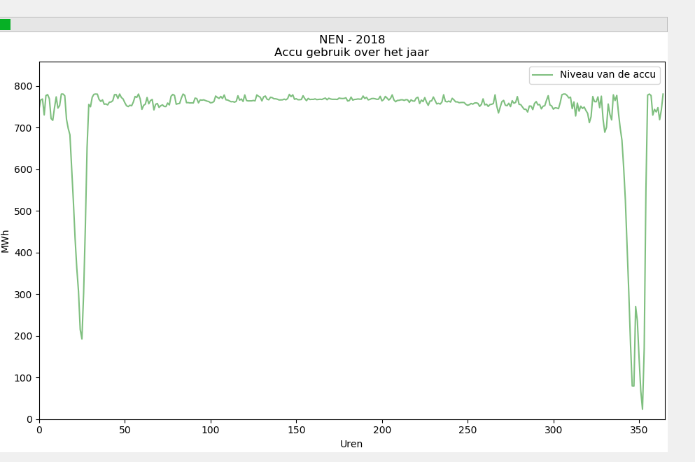

# Portfolio Michiel Maas - 16136640 - Danone Powerplant

## DataCamp
Ik heb alle verplichte Datacamp opdrachten gedaan. [Zie deze afbeelding als bewijs](Sources/datacamp.png). 
Ik heb bij een eerder blok van van de HBO-ICT: Software Engineering opleiding al deze precieze opdrachten gemaakt. Daarom was het best wel saai, en ik heb ik een beetje gehaast. 

## Research Project
### Aanpak
Voor dit onderzoek moesten wij kijken naar het optimaliseren van de energieproductie van een Renewable Power Plant. Danone wilde graag een 'groene' energiecentrale maken, maar dan het liefst zo goedkoop en efficiënt mogelijk. Dit is lastig omdat de energie productie van zonnepanelen en windturbines verschilt over het jaar, en de fabriek het hele jaar door een constante hoeveelheid energie nodig heeft om te blijven draaien. 
De energie die geproduceerd wordt door deze zonnepanelen en windturbines kan worden opgeslagen, maar dat is heel prijzig. Voordat Danone wilde beginnen aan het project wilde eerst graag goed weten hoe duur het zou worden en wat de beste manier was om dit te doen. 

Wij moesten dus kijken naar: 
> Een power plant die alleen energie opwekt met zonnepanelen en windturbines. Deze energie moet genoeg zijn om de fabriek het hele jaar draaiend te houden. En dit alles voor zo min mogelijk geld. 

Hieruit leidde onze onderzoeksvraag: 
> Wat is de optimale opstelling van een hybride solar/wind energy system voor een fabriek waarbij de kosten het laagst zijn?

Dit hebben we kunnen opdelen in de volgende deelvragen:
* Wat is er nodig om de aangeleverde simulatie in MATLAB aan te sturen via Python?
* Wat is het beste algoritme om de optimale hybride solar/wind energy configuratie te vinden?
* Welke hyperparameters zijn het beste voor het algoritme?
* Welke kosten zijn relevant voor het vinden van de optimale hybride solar/wind energy configuratie?
* Hoe werkt een hybride solar/wind energy systeem?

Deze vragen waren er vooral om ons te leiden in het begin van het process. Aan de hand van deze vragen hebben wij onze stappen kunnen nemen om het onderzoek uit te voeren. 
* Don en ik hebben samen gebrainstormd over het algoritme, en hoe we het konden bouwen. 
* De hyperparameters zijn gekozen door het gemaakte algoritme te tweaken en te kijken wat er uitkwam. Het bleek dat het verhogen van mutaties de tweede helft van de generaties handig was om lokale minima te ontwijken. 
* De kosten berekeningen bleven tijdens het project veranderen. Aurin heeft kabel kosten berekend, en de manier hoe we de prijs van windturbines berekend hebben we een paar keer aangepast. 

Later, na veel onderzoek, hebben we nog eens goed gekeken naar de onderzoeksvraag. Deze was niet meer in lijn met wat we precies aan het bewijzen waren, ook was die nog Nederlands. 
De onderzoeksvraag werd aangepast naar:
 > "How can a genetic algorithm be used to determine the most cost effective configuration for a renewable powerplant?".

### Methode
#### Algoritme Keuze
Donnelly en ik hebben even gebrainstormd over de dingen die wij konden doen, en de manieren om het aan te pakken. Ik stelde voor om een genetisch algoritme te gebruiken, omdat we dit zagen als een goede toepassing en ik er al [ervaring me had in een eerder blok](Sources/Travelling Salesman.java "Travelings Salesman Problem opgelost in Java voor Game of Trades"). 
Een genetisch algoritme is een goede oplossing voor dit systeem omdat we het eigenlijk proberen te 'bruteforce'. We willen zoveel mogelijk configuraties proberen totdat we de goede hebben, maar dan wel op een slimme manier. 
Dit is precies wat een genetisch algoritme doet. Door allemaal verschillende dingen uit te proberen, en deze resultaten te beoordelen op hun correctheid kan je het algoritme de goede kant op duwen.  Donnelly was erg ijverig en had het algoritme al snel af. 
Dit was fijn want hierdoor konden we snel de data analyseren. Maar voor de andere groepsgenoten die met het algoritme en de code moesten werken was het nog best ingewikkeld. Ik heb Aurin en Luc veel geholpen door het Algoritme van Donnelly goed uit te leggen zodat 
ze er mee aan de slag konden. Ook met het goed schrijven van code zodat het makkelijk samenwerkt met andere delen en het programma. 

### Resultaten
De resultaten waren best wel interessant. Sommige dingen haden we verwacht:
* Windturbines zijn erg rendabel en werden dus veel gebruikt
* De optimale hoek en oriëntatie van zonnepanelen is ongeveer 37 graden gericht op het zuiden
* In de zomer wordt er veel meer energie opgewekt dan in de winter. 

Zie deze afbeelding van de GUI die ik heb gemaakt voor een overzicht:

Maar wat ons zeker opviel dat er weinig wordt opgeslagen. Dit is omdat de huidige prijs van opslag enorm duur is. Het algoritme berekend dat het goedkoper is om meer zonnepanelen neer te zetten zodat het zelfs in de wintermaanden genoeg kan produceren om de nacht door te komen. 
Dit zorgt er op zijn beurt weer voor dat het in zomer veel meer produceert dan nodig. In totaal produceert de hele opstelling 150 keer zo veel energie als nodig is, en dit is erg inefficiënt.  
Je kan ook duidelijk zien dat er een periode is in het begin van het jaar waar de productie erg laag is, en daar veel batterij voor moet gebruiken. Maar de rest van het jaar wordt de batterij bijna niet gebruikt. 

### Vervolg onderzoek
Ons onderzoek geeft veel inzicht in het onderwerp, maar er is zeker nog ruimte voor volg onderzoek. Dingen waar we naar kunnen kijken zijn bijvoorbeeld:
* Gebaseerd op de huidige Algoritme

  Dit zijn toevoegingen op het huidige algoritme. Deze dingen zijn niet meegenomen omdat ze te ingewikkeld waren, niet de goede informatie hadden of niet relevant genoeg was voor ons onderzoek. Dit zijn vooral kleine aanpassingen die voor een meer realistisch beeld zorgen. 
  * Gedeelte implementeren dat het genetische algoritme bepaald om stroom van het net in te kopen. 
  *  Meenemen dat het algoritme overproductie terug verkoopt aan het net, en de opbrengst van de prijs afhaalt. 
  * Installatiekosten meenemen in het overzicht
* Het uitbreiden van de onze locaties en jaren op een groter schaal. Als de dataset groot genoeg is, kunnen we misschien trends herkennen en met een paar factoren al een goede schatting maken. 
  
  Dit hebben we niet kunnen toevoegen omdat wij de data niet hadden, maar leek ons wel tof. Het idee, dat we op een globale schaal kunnen bepalen wat de meeste rendabele opstelling is, kan veel inzicht geven. Dit kunnen we gebruiken om misschien andere technieken te vinden die het algoritme genereert, of misschien een beter globale trend herkennen. 
* Kijken of we een voorspelling kunnen doen van de weersomstandigheden van de komende jaren, en een simulatie draaien op de voorspelde weersomstandigheden.
  
  Hier hebben we over nagedacht, maar toch besloten om niet te doen. Dit was vooral omdat het heel erg moeilijk is. Er is veel data nodig, en het is heel moeilijk om het goed te krijgen. Het is wel heel handig omdat het idee van de powerplant is voor een lange tijd moet draaien. Als de voorspelde weerdata een meer betere of goedkopere opstelling geeft, heeft die de voorkeur. 

### Scrum
Persoonlijk ben ik erg fan van planning en overzicht, dus nam ik al snel te taak van Product Owner op me. Ik heb de volgende stappen genomen om het project in goede banen te leiden:
* Ik heb een grote backlog gemaakt van alles dat we moesten 
* Ik heb een gedetailleerd planning gemaakt van wanneer we welke sprint wilden starten
* Ik heb een Scrum Board gemaakt waarop de we taakjes konden bijhouden
* Ik heb een [Trello Board](https://trello.com/b/BhQsy3ST) aangemaakt waarop alle project genoten hun taakjes konden bijhouden en informatie kunnen delen. 

De eerste 2 sprints gingen erg goed. Ik heb de sprint review geleid en de taken telkens verdeeld. Mensen die hulp nodig hadden konden dat goed aangeven en de taken liepen makkelijk door. Maar toen Donnelly het algoritme aan het eind van de tweede week af waren er nog maar weinig grote taken te verdelen. 
Onderhand waren de taken ook al duidelijk verdeeld en hielden project genoten zich vooral bezig met hun eigen doelen en was er niet heel veel vraag meer na de sprint planningen. Toen onze planning na twee maanden werd gevandaliseerd, en het verlengsnoer uit onze werkruimte werd gestolen, was er niet heel veel vraag meer deze taken. 

### Git
Als enige Software Engineering student uit het groepje, was ik een enorme voorstander om Github te gebruiken. In de eerste week de [GitHub Repository](https://github.com/michieljmmaas/PowerPlantHHS) opgezet, en de benodigde instelling toegepast. Ik had het ingesteld dat mensen niet direct naar de master konden pushen, zodat die vrij was van merge conflicts. Groepsgenoten moesten een merge request aanmaken om hun stukjes code aan de master toe te voegen. Deze code kon dan controleren, en eventuele merge conflict oplossing. Ik heb vooral Aurin en Luc veel geholpen om hun code goed te verwerken door hun onbekendheid met Git.
 In totaal zijn er 320 commits gemaakt, 63 merge requests verwerkt. 
 
## Communication
### Presentaties
Ik gaf in het begin van de periode al aan dat ik goed was in Engels en weinig problemen heb met presenteren. Dit kwam goed van pas omdat er in de groep ook mensen waren die liever niet presenteerden. Ik bood me regelmatig aan om te presenteren, en ben zelfs een paar keer last-minute (terwijl andere groepjes al aan het presenteren waren) ingesprongen toen een projectgenoten te laat was, of het programma niet aan de praat kregen. De presentaties die ik heb gegeven zijn:

* [9 December - Maandag presentatie](Sources/Presentaties/Renewable_power_plant_9_december.pptx)
* [1 November - Milestone presentatie](Sources/Presentaties/Renewable_power_plant_1_november.pptx)
* [14 Oktober - Maandag presentatie](Sources/Presentaties/Renewable_power_plant_14_oktober.pptx)
* [27 September - Milestone presentatie](Sources/Presentaties/Renewable_power_plant_27_september.pptx)

### Research Paper
Nadat we de meeste research hebben gedaan is het skelet van de paper opgesteld. Alle kopjes werden aangemaakt zodat de project genoten de konden aanvallen. Ik heb samen met Aurin gekeken naar de papers die hij had gevonden, om te beslissen welke het beste aansloegen op wat we wilden schrijven. 
In de tussentijd hebben we veel feedback gekregen van onze opdrachtgever, Arie Taal, en begeleider van de Groene Mient Groep, Baldiri Salcedo. Ik heb me best gedaan deze feedback zo goed mogelijk toe te passen op wat we hadden geschreven en benodigde stukken om te schrijven zodat het aan gewenste opmaak voldeed. 
Nadat alle kopjes waren ingevuld, we de alle benodigde resultaten hadden verzameld en alle feedback was verwerkt hebben de paper gezamenlijk verbeterd. De paper wordt op een scherm getoond, en samen beslisten we hoe we dingen wilde verwoorden. Mijn engels skills kwamen hier goed van pas om de zinnen goed te laten verlopen.  

Omdat het schrijven van de paper voornamelijk gezamenlijk ging is het moeilijk om aan te tonen welke dingen ik precies heb gedaan op dit punt. Dingen ik heb geschreven voor de laatste draft waren:
* De Abstract
* Het stuk over het Genetische Algoritme, en het vinden van de toepasbare paper. 
* Conclusion 

 
## Data preprocessing
### Dataset
De dataset die wij hadden bestond uit twee delen. Het eerste deel was de weerdata. 

#### Weerdata
De NEN heeft een gemiddelde gemaakt van weergegevens die de afgelopen 20 jaar zijn gemeten op het weerstation De Bilt. De hebben per maand gekeken welke maand de meeste gemiddelde weersomstandigheden had, en hier van de uurlijkse windgegevens beschreven van de zonnestraling, windsnelheid en temperatuur. Deze gegevens konden we 
gebruiken om de bepalen hoeveel energie de zonnepanelen en de windmolens konden opwekken. Uiteindelijk toen we de opdracht hebben uitgebreid naar meerdere windstations en jaren hebben die data moeten ophalen. Deze data konden bij de KNMI vinden, maar was niet helemaal zoals gewenst. Deze is opgeschoont en verwerkt zodat we die 
konden gebruiken in de simulatie. 

#### Configuratie
De configuratie gaf aan hoe we opstelling van zonnepanelen en windturbines was opgesteld. Hoewel de weerdata bij iedere draai van het genetische algoritme hetzelfde bleef, was de configuratie bij iedere berekening anders. De configuratie gaaf het volgende aan:
* Aantal Wind Turbines
* Lengte van de windturbines
* Power curve van de windturbines (hoeveel de windturbines produceerde bij welke snelheid)
* Voor vier verschillende zonnepanelenveld (om variatie aan te bieden in de data set)  
  * De oppervlakte
  * De de hoek naar de zon
  * De oriententatie

Verder waren er bevatte deze configuratie ook informatie over de Terreingesteldheid (dit bepaalde hoeveel wind de windturbines kan vangen door omliggende gebouwen/natuur) en de efficiëntie van de zonnepanelen. 
De configuratie bepaalde het algoritme zelf, door willekeurige waardes aan te leveren, te kijken welke het beste werkte en die te beteren. 

#### Toepassingen
Om te berekeningen hoeveel energie de configuratie oplevert aan energie, werd de configuratie geladen in de simulatie. De Simulatie was ingesteld op de geleverde weerdata  Voor het genetisch algoritme hadden we dus een vaste dataset, de weerdata, een variabele, de configuratie. 
Er was dus niet een boel csv bestanden met vector coördinaten die we moesten uitlezen, of een set waarmee we het konden vergelijken. Dit vroeg dus om een andere aanpak. 

### GUI
Als een van de mensen in de groep met de meeste ervaring met programmeren wilde ik graag een grote impact maken op het onderzoek. Maar omdat Donnelly al het genetisch algoritme had geschreven, en Jeremy bezig was met de link tussen Python en Simulink was er niet meer een duidelijk taak voor mij over. 
Ik heb toen ervoor gekozen om een GUI te maken voor de applicatie.  Hoewel dit niet direct hielp met de voortgang van het onderzoek, was dit later wel heel handig. Onze opdrachtgever, Arie Taal, had veel verzoekjes voor kleine aanpassingen. 
Het implementeren van deze aanpassingen, en het genereren van de output daarvan, kostte veel tijd. Mijn doel was om het makkelijk te maken voor meneer Taal om zelf deze aanpassingen toe te brengen en de gegevens zelf te interpreteren. 
Het belangrijkste was om alle verschillende parameters mee te kunnen geven aan aan het algoritme, zodat die erop kon trainen. Op dit moment is het mogelijk om de volgende parameters mee te geven aan het algoritme:
* Hyperparameters  
  * Aantal Generaties
  * Pool van berekeningen
  * Maximum mutatiepercentage van waarde
  * Kosten te weinig productie
  * Vraag van de powerplant  
    * Dit is ook als een .csv bestand om een variabele vraag over het jaar mee te geven
* Zonnepanelen  
  * Kosten per vierkante meter
  * Minimaal oppervlakte zonnepanelen
  * Maximaal oppervlakte zonnepanelen
  * rendement van de zonnepanelen
  * prijs van de zonnepanelen
* Wind Turbines
  * Maximaal aantal windturbines
  * Prijs van de windturbines
  * Rendement van de wind turbines
  * Terreingestelheid
* Kabel  
  * Lengte van de kabel
  * Spanning over de kabel
* Prijs van opslag
* Locatie en jaar van weerstation 
  
Dit geeft onze opdrachtgever veel mogelijkheid om de opstelling zo te configureren hoe hij wil, en scheelt het ons tijd om het voor hem te doen. 

Om deze dingen goed mee te geven moesten delen van Donnelly's code worden herschrijven. Zie hiervoor de [train()](Sources/train.py) functie, en alle optionele parameters die daaraan worden meegegeven. Die de [Sources/GUI folder](Sources/GUI) voor de code die ik heb geschreven.  
Het gedeelte waar ik nog wel het meest trots op ben zijn de grafieken die overzicht geven van wat het algoritme heeft berekend. Deze afbeeldingen zijn te vinden in [dit imgur album](https://imgur.com/a/3vXyAnp). Bekijk ook  <a href="https://youtu.be/QEC2Tzraq0Y" target="_blank">de video</a> die laat zien hoe het werkt.

De GUI laat de volgende informatie zien:
* Configuratie  
  * Aantal en hoogte van de windturbines
  * Hoeveelheid opslag er nodig is
  * Voor vier verschillende velden van zonnepanelen:  
    * De oppervlakte
    * De hoek in graden richting de zon
    * De orientatie
    * En een gemiddelde/sommering van de vier velden
* Grafieken  
  * Goedkoopste configuratie uit de pool
  * Gemiddelde prijs uit de pool
  * Productie over het jaar
  * Cumulatieve productie over het jaar
  * Accu gebruik over het jaar
  * Verhouding in energieproductie tussen de zonnepanelen en de windturbines
  * Totale prijs en onderverdeling daarvan
  
Deze gegevens worden iedere generaties geupdate zodat je het algoritme in realtime kan volgen. 

Dit was erg handig om fouten en bugs te herkennen. We kwamen er bijvoorbeeld achter dat het algoritme soms in een lokaal minimum zit waar geen enkele opstelling in de pool genoeg produceert, maar het er zich zelf uiteindelijk weer uit haald. Ook viel het ons op dat het algoritme niet goed convergeert. 
Als je de prijs van de opslag erg goedkoop maakt, verwacht je dat het algoritme niet zou overproduceren, en alles netjes zou opslaan en hergebruiken. Gelukkig hebben we dit kunnen aanpakken. 

### Data Formatting & Cleansing
Omdat de data die wij kregen al redelijk goed was, hoefde dit niet prese voor ons project. Toen we de opdracht gingen uitbreiden zodat wij ook konden draaien op andere weerstations in andere jaren, moest die data wel goed geformat worden zodat het algoritme het kon inlezen. Hier heb ik zelf niet aan meegedaan. Ik heb 
vooral de gegevens zo opgesteld zodat het algoritme er goed mee aan de praat kon, en de outputs van het algoritme goed kon tonen op het scherm. 

## Reflectie
### Eigen Contributie
#### Situation
De opdracht die wij kregen was misschien een beetje onderschat. Door het toepassen van een slimme oplossing viel de uiteindelijke werkdruk heel erg mee. Er was alsnog veel te doen, maar dan op ander gebied. Er was minder aandacht voor Data Science, en meer voor perfectioneren en buiten activiteiten buiten het curriculum om. 

#### Task
Als enige Software Engineering student van de groep wilde ik me graag focussen op het schrijven van code en het toepassen van Code Project Doelen. Hierbij bedoel ik Scrum, Git en ontwerpstappen. 

#### Action
Ik heb me gefocust op de GUI omdat dat een grote programmeer taak was. 
Met mijn ervaring met Scrum en Git heb ik de taak van Product Owner en Git Master opgepakt. 
Met mijn engels skills heb ik me ingezet bij het schrijven van de paper en het geven van de presentaties. 
Ik heb Aurin en Luc geholpen met het uitleggen van de code en het algoritme. 

#### Result
Hoewel de GUI niet direct heeft geholpen bij de voortgang van het onderzoek, was het later wel handig. Het scheelde ons tijd omdat de opdrachtgever ons niet meer lastig viel met kleine vragen en aanpassen. Zo konden we ons focussen op het schrijven van de paper. 
Ik heb aan het begin van het blok een planning gemaakt voor het hele semester, de backlog opgesteld en het Trello board aangemaakt. De eerste twee sprints was het erg handig, maar toen de werkdruk afnam hebben we er een stuk minder gebruik van gemaakt. 
Ik heb een aantal presentaties gegeven omdat ik merkte dat niet iedereen het fijn vond om te doen. Persoonlijk heb ik weinig problemen met presentaties, dus deed ik het graag. Ook bij de paper kon ik goed helpen om mooie engelse zinnen te schrijven en de stukken zo maken dat het goed leesbaar was. 

#### Reflection
Ik vind het jammer dat ik niet zo veel heb kunnen bijdragen aan het Data Science gedeelte van het project. Hoewel de GUI uiteindelijk erg handig was, had ik liever me tanden gezet in iets ingewikkelders. 
Ik had gehoopt dat we echt Deep Learning konden toepassen, en een echt moeilijke case voor ons hadden staan, maar dat was niet zo. Ik heb nog gepleit met de project genootjes om dingen erbij te makken, maar we hebben uiteindelijk besloten om het niet te doen. 
Als ik het over had kunnen doen had ik misschien eerder aan de bel kunnen trekken en vragen of ik bij een ander groepje mocht die een meer uitdagende opdracht had. 

### Leerdoelen
#### Situation
Dit blok draaide vooral om de Basics van Data Science. Ik heb me aangemeld omdat ik het onderwerp erg interessant vond. Ik houd van optimaliseren en overzicht in data.

#### Task
Ik wilde leren over Neural Networks, Machine Learning en wilde werken aan grote data sets. Het liefst ook met een toepasbare opdracht met een mooi eind. 
Deze dingen kon ik leren door te werken aan het project, papers te lezen en de colleges te volgen. 

#### Action
Ik heb in de colleges gevolgd, de DataCamp opdrachten gemaakt en daar buiten om nog extra informatie opgezocht. 
Ik heb papers gelezen voor ons onderzoek en nieuwe toepassingen geleerd. 
Voor onze research opdracht hebben we gebruik gemaakt van een Genetisch Algoritme, iets waar ik al ervaring mee had. 
Ik heb veel Python code geschreven, iets waar ik wat minder ervaring mee had, maar vooral om een GUI te maken. 

#### Result
Uiteindelijk heb ik niet heel veel geleerd. Zelf leer ik het meest door dingen toe doen, maar omdat we iets gebruikt waar ik al ervaring mee had, en het grotendeels 
zelf niet eens gemaakt heb, viel het een beetje tegen. Colleges waren interessant, en de papers vertelde over coole dingen, maar verder ben ik niet heel veel
slimmer geworden op het gebied van Data Science. Ik heb niet het idee dat ik veel meer weet over Data Science dan een willekeurige andere HBO-ICT student. 
Aan de andere kant zijn mijn python skills wel veel beter geworden. Ik gebruik het nu zelfs soms om snelle scripts te maken om dingen uit te rekenen. 

#### Reflection
Ik vind het erg jammer dat ik niet meer met Data Science heb kunnen doen tijdens het blok. Hoewel de colleges interessant waren en de basis goed uitlegde, bleef het bij de basis. Het tentamen was naar mijn idee erg 'surface-level', daar had ik prese al die colleges voor hoeven volgen. En het gekozen algoritme voor onze opdracht
was een algoritme dat ik al een keer eerder had gemaakt. Tijdens presentaties zag ik wat andere groepen aan het doen waren en dat zag er soms wel erg cool uit, en toen vond ik het jammer dat ik het niet heb kunnen doen. Ik kan mezelf nog wel meer verdiepen in het onderwerp, maar het is moeilijk om een opdracht te vinden die 
zo goed toepasbaar is als die we kregen van school. We hebben met de groep nog gekeken of we de opdracht konden uitbreiden. Uiteindelijk hebben we besloten om dit niet te doen, maar haar heb ik misschien een beetje spijt van. 

### Groep 
#### Situation
De groep bestond uit 5 leden. Een Mechatronica student, een Elektronica studen, twee Networks & System Engineering studenten en ik als Software Engineering student. Iedereen sprak nederlands, en de sfeer was erg goed. 

#### Task
Samen moesten we een oplossing bedenken voor onze research opdracht, een algoritme schrijven die de data kon verwerken, de data visualiseren en een paper schrijven. Het was de bedoeling dat iedereen op elk vlak zijn bijdragen kon leveren, maar ook zijn specialiteit kon gebruiken. 

#### Action
In het begin zijn de taken verdeeld naar specialiteit. De ICT studenten gingen vooral programmeren en de andere studenten stortte zich in het begin op de research. Later draaide we de taken om, zodat iedereen een beetje van alles had gedaan. Dit werkte best wel goed omdat na de switch goed
duidelijk was wat er nog moest gebeuren. Wat ook goed hielp is dat we bijna iedere dag hebben afgesproken. Het punt alleen al dat je zit met je groepje 

#### Result
De taakverdeling was best goed. Hoewel de ICT studenten een stuk meer code hebben geschreven naar de andere, voelde het wel als een groep effort. Omdat Donnelly zo snel het algoritme af had, was de werkdruk heel laag. 
Dit zorgde voor veel vrije tijd, wat op zijn beurt zorgde voor een goede groep. We hebben zelf tijd genomen om een middag Dungeons & Dragons te spelen, naar de boerenprotesten te gaan op het Malieveld en hebben meegedaan aan een Techaton.
Ik merkte in het midden van het project dat ik genoeg tijd over had voor een bijbaantje. Ik had overlegd met groepsgenoten, en ben gaan solliciteren, en heb er eentje kunnen vinden. Gedurende het project deed ik goed mijn best om duidelijk te communiceren wanneer ik zou werken, en wat ik zou doen voor het project. 
Ik vond dat dit best wel goed is gelukt.  

#### Reflection
Ik vond de groep erg fijn. Iedereen had een specialiteit en heeft die goed kunnen toepassen. Hoewel Donnelly het algoritme heeft geschreven, voelt het niet alsof hij het hele project heeft gemaakt. Wij hebben de rest goed kunnen aanvullen en het tot een totaal plaatje kunnen maken. 
Het was fijn dat alle leden nederlands spraken en dat me samen zo'n mooi ding hebben kunnen neerzetten. Wat ook erg goed was, was dat we duidelijk communiceren met elkaar en dat we bijna elke dag afspraken. Zo bleef iedereen bij het project en hebben we veel gedaan gekregen. 

## Conclusie
Dit blok vond ik best wel leuk, maar door omstandigheden misschien iets te makkelijk. Deels doordat wij een slimme oplossing hebben kunnen vinden voor onze vraag, maar deels ook de inhoud van de colleges. Ik had graag meer uitdaging gehad, en misschien wat dieper op de stof in. Het onderwerp vind ik erg cool
maar ik heb nog steeds niet echt het idee dat ik veel meer weet van Data Science dan een willekeurige andere Informatica student. Misschien was het ook ons groepje, maar de werkdruk lag dus zo laag dat ik een bijbaantje heb genomen om mijn tijd beter te gebruiken. Ik had niet het idee gehad dat dit ten koste ging 
van mijn schoolprestaties. Ik heb begreep dat het blok is ontworpen om mensen met een bijbaantje te ondersteunen, maar volgens mij is het niet de bedoeling dat mensen door de lage werkdruk een bijbaantje nemen. 

Feedback voor de minor voor volgend jaar:
* De maandag presentaties waren een beetje nutteloos voor de studenten. Misschien is het beter dat de begeleiders van de minor bij de project groepjes langs gaan. Nu werden we iedere week gegijzeld en moest je de presentaties van de andere groepjes aanhoren. 
* Misschien dieper op de stof in. De eerste paar colleges waren fijn, maar nadat die waren afgelopen was het een beetje globaal. Ik had graag meer willen leren over verschillende technieken, hoe en vooral waarom bepaalde algoritmes/Neural Networks werken. Doordat het redelijk simpel was voelde het tentamen *te makkelijk* aanvoelde. Maar misschien wordt het dan te moeilijk voor niet ICT studenten.  
* De python notebooks waren wel cool, maar de functies die werden aangeroepen om te training waar en beetje abstract. In kon zien dat je met Nearest-Neighbour kon trainen, maar niet hoe de functies precies werkte.   
